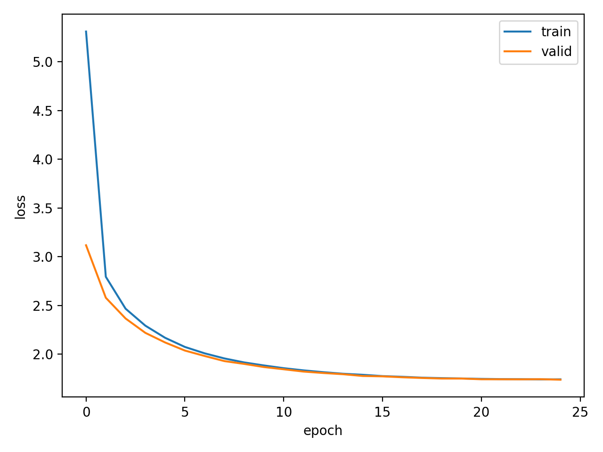

# CS336-assignment1：From-Scratch Large Language Model (PyTorch)

* Implemented the **entire training and inference pipeline of a large language model from scratch**, using only **core PyTorch primitives**. No high-level training frameworks, no integrated model libraries, and no AI-assisted code generation were used.

* Designed and implemented a **Byte Pair Encoding (BPE) tokenizer** from the ground up, addressing key challenges in tokenizer training, encoding, and decoding.
  The tokenizer supports **efficient large-scale training and streaming text processing**, achieving **end-to-end BPE training on OpenWebText (11GB) in under 3 minutes**.

* Built a **decoder-only Transformer architecture** following mainstream LLM designs, with **all components implemented independently**, including:

  * Linear projection layers
  * Rotary Positional Embeddings (RoPE)
  * Causal masking
  * Multi-head self-attention
  * Feed-forward networks (SwiGLU)

* Implemented a complete **training loop from scratch**, including **AdamW optimizer**, gradient clipping, learning rate scheduling, checkpointing, and evaluation.
  Pretrained the model on **TinyStories** and **OpenWebText**, achieving stable convergence with
  **train loss = 1.7402 | validation loss = 1.7363**.

---

## 📉 Training & Validation Loss

> Replace the image below with your actual loss curve.



---

## ✨ Text Generation Demo

> Example text generated by the pretrained model.

```
Once upon a time, there was a little girl named Lily. She had a big, red ball that she loved to play with. One day, she went to the park with her mom.
At the park, Lily saw a boy named Tim. Tim was sad because he had no toys. Lily wanted to help Tim. She said, "Let's play with the ball together!" Tim was happy and they played with the ball.
Then, something unexpected happened. The ball started to move! It went up, up, up into the sky. Lily and Tim were very surprised. They laughed and played with the ball. From that day on, Lily and Tim were best friends.
```

---
